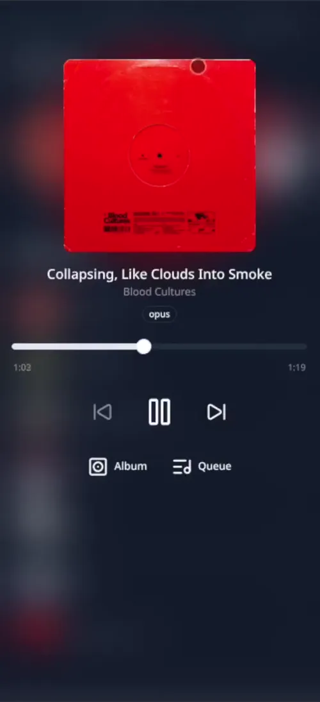
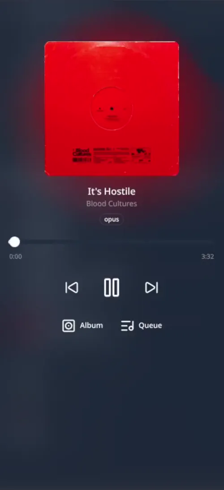
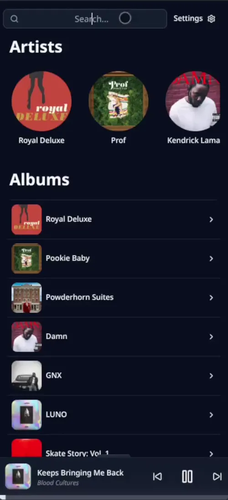

# MusicStreamer

    
      &nbsp;&nbsp;&nbsp;&nbsp;
    
      &nbsp;&nbsp;&nbsp;&nbsp;
    

## Introduction
Self-hosted music streaming application that lets you stream your local music library across any device.  
Featuring a responsive Web UI built to feel like a native mobile application, with a Capacitor port for iOS and PWA support for a more native experience on any platform.  
All backed by a server that handles library scanning, metadata enrichment, audio transcoding, and range-based audio streaming.  

## Frontend Features
- **Search:** Real-time fuzzy search across track titles, artist names, and album titles.
- **Queue Management:** Swipe to add or remove tracks from the queue, with an "Up Next" view showing the queue.
- **Audio Visualizer:** Animated blob visualization driven by real-time frequency analysis of the playing track, with dynamic colors extracted from album artwork.
- **Mobile-First UI:** Bottom sheet navigation, gesture controls, haptic feedback, and safe area support for a native mobile feel.
- **Media Session Integration:** Lock screen controls and hardware media button support.
- **Player State Persistence:** Current track, queue, and playback position are saved and restored across sessions.

## Backend Features
- **Library Scanning:** Scans a configured media folder for audio files (MP3, FLAC, WAV, OGG, M4A, AAC) and imports track metadata, albums, and artists using TagLib into a PostgreSQL database.
- **Audio Transcoding:** Converts FLAC files to Opus format (128k bitrate) in the background, enabling lower-bandwidth streaming when on mobile data.
- **Metadata Sync:** Integrates with MusicBrainz and CoverArtArchive to enrich your library with accurate metadata and album cover art. Local artists are matched to MusicBrainz entries through an artist disambiguation step, then albums are synced and cover art is downloaded automatically.
- **Audio Streaming:** Serves audio files with HTTP range request support for seeking and playback.
- **Cover Art Management:** Stores album artwork in multiple resolutions (original, 150px, 600px) for fast loading.

## Settings Menu
The settings menu ties the frontend and backend together, providing access to server-side operations and client preferences:

- **Load Local Library:** Triggers a scan of the media folder to import new tracks.
- **Transcode Tracks to Opus:** Kicks off background transcoding of FLAC files, with a live status indicator (amber for running and green for ready).
- **External Metadata:** Opens the MusicBrainz artist disambiguation and album sync interface.
- **Auto Audio Format:** Automatically selects the best audio format based on network conditions (e.g. Opus on cellular, FLAC on Wi-Fi).
- **Preferred Audio Format:** Manually choose between FLAC and Opus playback when auto-detection is disabled.

## Planned Features
- **Playlist Creation:** Users don't have a way to create a playlist, this should be an easy feature to add.
- **User Management & Auth:** This application doesn't feature any way to have multiple accounts/auth, everything is "secured" by running it on a tailscale network. This should change.
- **User Listening Tracking:** Track user's listening habits and form a "Most Listened To" playlist. This should be done by weighing different actions the user takes within the UI (eg. skipped song, listened to 80% of song, etc...)
- **Automatic Recommendations:** Initially, integrate with Spotify's recommendations engine. Later on, build own library for extracting track features and recommend based on own engine.  

## Known Issues
- **Audio Analyzer (Animation when track is playing):** Only triggers if user is on the track's page. If on iOS and started a song this way background listening breaks. As a workaround you can close and re-open the capacitor app and then play the song through the bottom widget.
- **File is being requested directly when streaming audio:** When a user requests a song for range streaming from the server, it requests based on a file path. This was done to avoid lag when changing songs. This is a bad pattern and should be fixed, ideally by utilizing track ids rather than file path. It is currently mitigated by running everything on a tailscale network.
- **Capacitor app expires after 1 week:** If publishing the application as a capacitor app, due to how apple handles developer certificates, it expires after a week. That doesn't really bother me but beware if you are on a free apple developer account. There is also the PWA option but you lose haptic feedback and some performance.